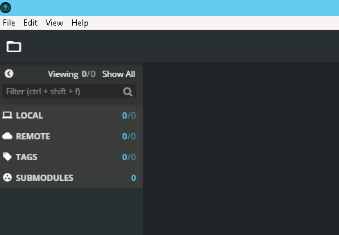
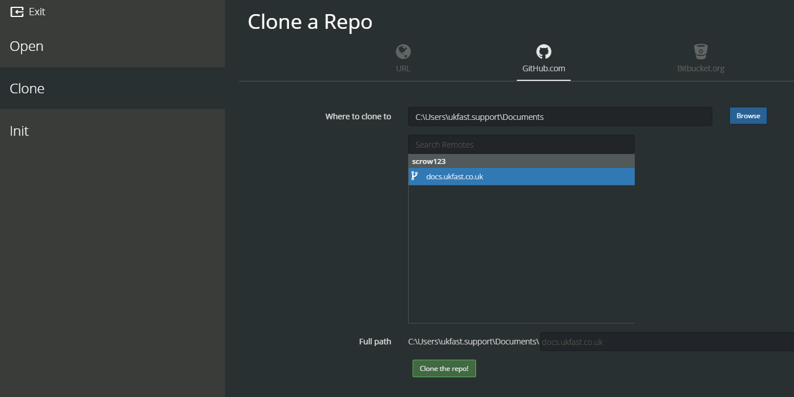
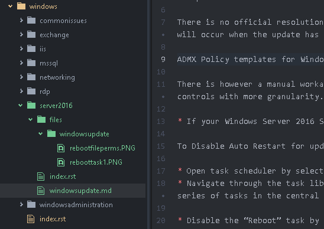
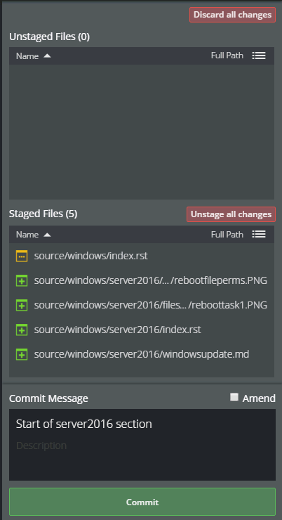
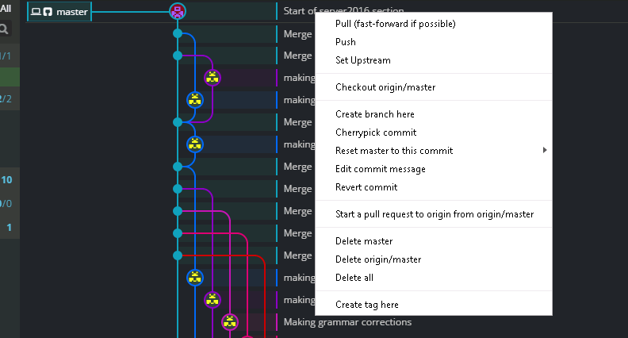
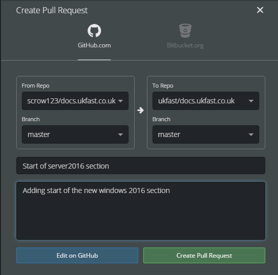
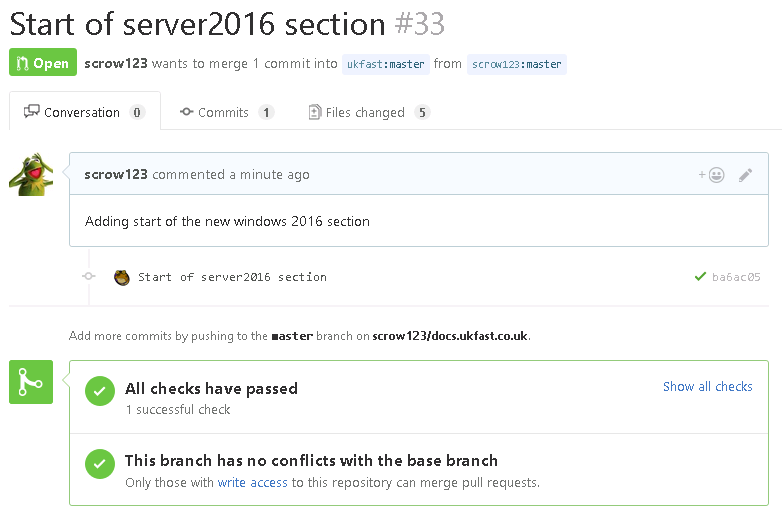
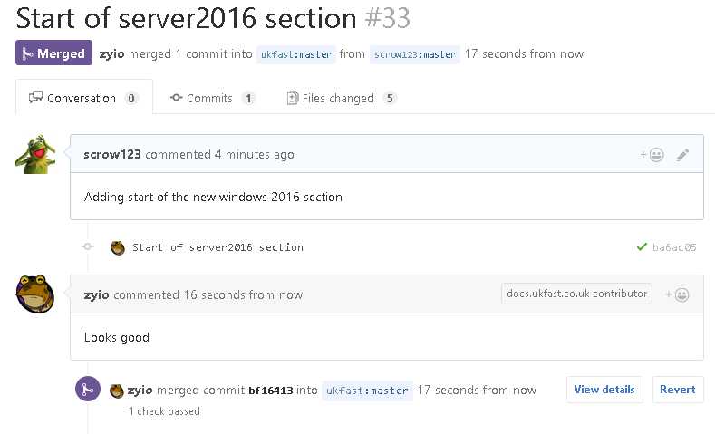

# Contributing 

## Windows

### Prerequisites

* Github account - Hopefully you already have this! If not, you can [sign up here](https://github.com/join?source=header-home).
* Text editor - We'll be using [Atom](https://atom.io/) in the examples here, but use whatever you're comfortable with.
* Git client - [GitKraken](https://www.gitkraken.com/) will be used in the example, but there [are](https://git-for-windows.github.io/) [other](https://www.sourcetreeapp.com/) [options](https://git-scm.com/download/win)

### Adding content

Log into github.com, and go to the UKFast docs repository, [located here](https://github.com/ukfast/docs.ukfast.co.uk).

As you're likely not an authorised user on the repository, the 'git way' of making changes to it is to first 'fork' the repository, then make the changes to that one and then propose that the changes be pushed back to the main ukfast repository via a 'pull request'. It may sound complex, but we'll walk through the steps now. 

First, we have to fork the repository, which you can do using the 'fork' button in top right of the [UKFast docs repository page](https://github.com/ukfast/docs.ukfast.co.uk):

Now we've got a copy of the repository in our account, it's time to switch to gitkraken to download it to our local machine. 

Open up gitkraken and follow the prompts to log in with your github account details:

Once logged in, click the folder icon in the top left:

Then `Clone`, then `GitHub.com`.

Once here, choose the local file path where you'll store the docs repository and all it's files (we're just storing it under `Documents` in this case).

Then select the 'docs.ukfast.co.uk' fork we created earlier under your username:

Click `Clone the repo!` to start it downloading to your computer.

Initialise the submodules if prompted, and then click the green button that appears to open the repository up in gitkraken.

You should now be confronted with something exciting looking, like this:

So now we've got it locally, it's time to open it in our text editor and make the changes we want.

In atom, open the entire directory with `file` > `open folder` and then navigate to and select `docs.ukfast.co.uk` from wherever you saved it.

Now, make whatever changes you're aiming to make. In this example, we've added a new subcategory to the `windows` section, called `server2016`. There's an accompanying new directory called `files` for the screenshots, an index page to list all the contents, and the actual content itself in `windowsupdate.md`. We've also updated the `index.rst` file in `windows` to tell it about the new `server2016` category. This is all shown in the following screenshot. Note how new files/directories are shown in green and modified files are shown in yellow.

Content added, we're back over to gitkraken to get the changes committed to git.

Back in gitkraken, you should see that the changes you've made are now shown as 'ahead' of the master branch:

As we can see there, there are 4 new files and 1 updated one, using the same green/yellow notation as we saw in atom.

Click on the 'WIP' line and select 'Stage all changes' on the right hand bar. This sets up all the files ready to be committed. Put a Commit message in the box at the bottom describing the changes you've made, so that other users get a feel for what changes have been made without having to review it all manually. It should look something like this:

Press `commit`. You'll now see that `WIP` has disappeared. In the tree view in the middle, you'll see that your local version of the `master` branch is one step ahead of the version that's stored on `github`. 

At this point, you can either make more changes and also commit them, or if you've got nothing else to change, we can skip straight to pushing your local version to github, bringing them inline with each other.

To push your changes to github, simply press the `push` button located along the top. After that, your local and github repositories should be inline, like so:

Now that our forked repository has our new content (feel free to log into github.com and check this), the next step is to merge your new version of the docs into the proper UKFast repository. This is done using the `pull request` mechanism we touched on briefly earlier.

To do this, right click on your new commit and select 'Start a pull request to origin from origin/master':

Adjust the 'To Repo' so that it's going to the `ukfast/docs.ukfast.co.uk` repository and then fill in the `Title` and `Description` fields with something descriptive. Filled out, you'll have something like this:

Press `Create pull request` to raise a pull request for your content, against the UKFast docs project.

On the github.com website, under the `Pull requests` tab along the top (or located [here](https://github.com/pulls)), you can see your open pull request in all it's glory:

If you open this, you can see the content you created in GitKraken, along with the status of the automated tests that are run against your new content:

The administrators of the UKFast docs project will be notified at this point that a new pull request has been started against the docs project. They'll either accept the request or comment on it with any changes that may be needed. Once it's accepted, it will be automatically merged into the master branch and the changes will be live to see on docs.ukfast.co.uk!

