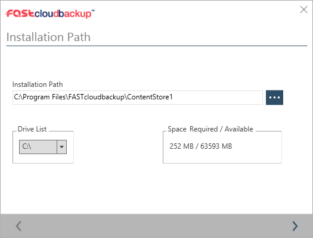
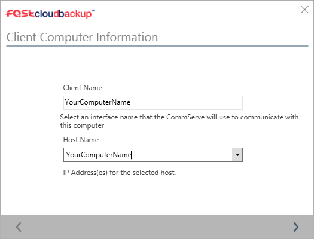
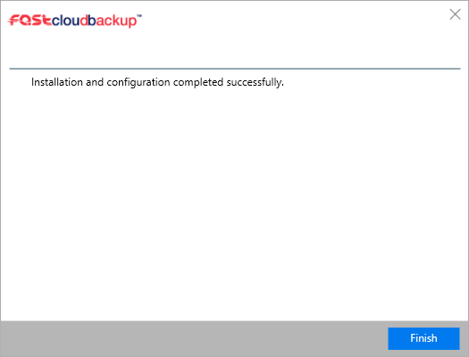

# Setting up the FASTcloudbackup agent

## Downloading the agent

Login to the [FASTcloudbackup web console](https://fcb.ukfast.co.uk) and click `Download Center` (apologies for the US spelling!).  

Find the appropriate Windows or Linux agent and click `Download`.  The agent will download based on your web browser's usual download process.  

## Installing the agent - Windows

Find the agent in your browser's download folder and open it.  Follow the instructions given to install the agent.

Select where to install the FASTcloudbackup agent. By default this will be to C:\Program Files\FASTcloudbackup\ContentStore

The installer will proceed to install the FASTcloudbackup agent on your computer.

You will be asked to name your computer on how it will be displayed in your FASTcloudbackup console. By default, this will be the local hostname of the computer running the install, alternatively you can change this to make it easier to identify the computer. It is recommended to keep the Client Name and Host Name as the same value.

When you come to a screen called CommServe Authentication, you should enter the same User Name and Password that you used to log in to the FASTcloudbackup web console.

The installation will the complete and you can begin to manage backups of this computer in the FASTcloudbackup web console.

## Installing the agent - Linux

[Oli please can you write this section, I have no experience of setting up the Linux version]

## Checking the agent is set up correctly

Once you've installed the agent on your computer or server, you can check it's been set up properly by heading back to the [FASTcloudbackup web console](https://fcb.ukfast.co.uk).  From the home page click `My Data` and you'll be taken to a page called Computers.  On here you will see the computer(s) and server(s) you have installed the FASTcloudbackup agent on to.

