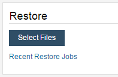
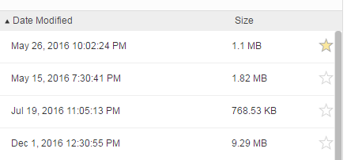

# Managing Files and Folders

Once your files and folders have been backed up using FASTcloudbackup, you can manage them within the web console.

To find your files, go to `My Data` from the homepage and click `Restore` next to the relevant computer or server.  Alternatively if you're aleady within the Settings for the specific computer or server you wish to work with, click `Select Files` in the Restore area.

Then use the file explorer to navigate to the files or folders you wish to work with.

## Working with files

To view a file, simply click on the file name and a window will open within your web browser, showing the contents of the file.  If you wish to download the file, you can click `Download` in the bottom left corner of this view.

For additional options such as viewing previous versions or erasing the file, click the checkbox next to the file name and use the menu that appears at the top of the screen:

- Restore: will restore the file to the computer or server it was backed up from
- Download: will download the file to the device you are using at present
- Versions: will give access to previous versions of this file (note that previous versions are only available for 28 days, which is the retention period for FASTcloudbackup) 
- Erase:  will delete the file from the backup (but not from the original computer or server it was backed up from)

## Favourite folders

If there are certain folders you need to access frequently, then marking them as a Favourite will give you quicker access to them.  Simply click the star icon next to the folders you wish to set as a favourite.

When you want to navigate to a favourite folder, click `Favourites` in the left hand menu, and you'll see a list of your favourite folders.

