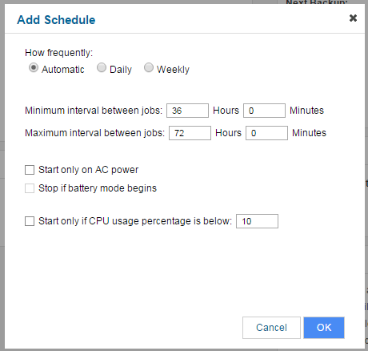

# Setting up backups

## Choosing which files and folders to back up

From the home screen of the [FASTcloudbackup web console](https://fcb.ukfast.co.uk) click on `My Data`, find the computer or server you wish to work on and then click `Settings`.

The default setting is that everything in your C:\Documents folder will be backed up when you run a backup.  If you wish to change which files and folders are backed up, go to the Content area on the right hand side and click `Edit`.

You can choose which files and folders to include in your backup process, or alternatively which ones you wish to exclude.  Click on the `+` symbol to specify which files and folders to include or exclude. 

Then navigate through your file structure to choose files and folders.

You can return to the default setting (backing up everything in C:\Documents) by clicking `Reset to Default Content`.

## Running a manual backup

You can run a manual backup at any time, simply click `Backup Now` in the Schedules area. The backup will run immediately.  Note that if this is the first backup then it may take some time, depending on the size of the files and folders being backup up.  Subsequent backups are incremental, only backing up changes and/or new files created, and hence will generally be quicker to run.

## Creating a backup schedule

You can create a backup schedule, so that your backups run automatically.  To do this click the `+ Schedule` button.  

You can create schedules on a daily or weekly basis, where backups run at a set time of day/day of week.  Alternatively you can set a minimum and maximum time period between each backup job - backups will then run automatically during the specified time window.

## Amending your backup schedule

You can amend your backup schedule as necessary, deleting and or changing existing scheduled backups.  To do this click on the scheduled backup, make the changes required and click `OK`, or else click `Delete` to remove the scheduled backup.

