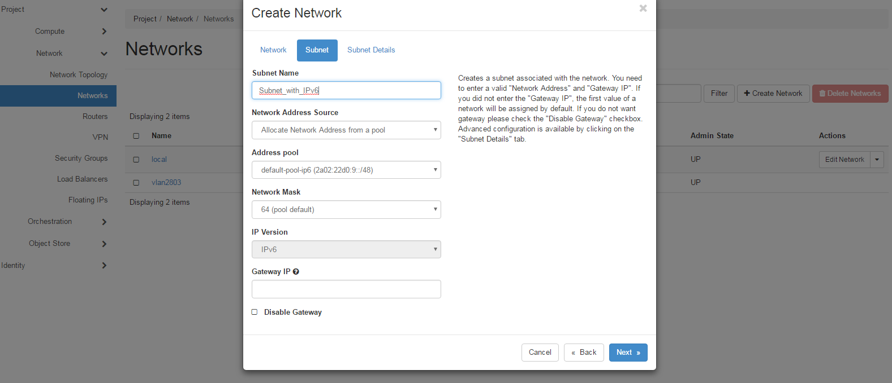
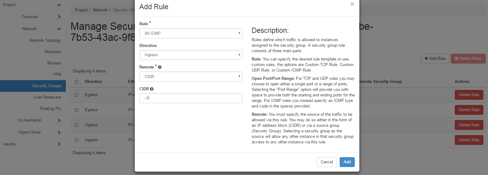

# Using IPv6 on eCloud Flex

You can now use IPv6 on your eCloud Flex project. Each subnet you create that you want to have IPv6 on will be allocated a /64 prefix from a /48 prefix defined by UKFast (the standard tenant network quota will limit the number of subnets a tenant can request).

All supported eCloud Flex Linux images (Windows images coming soon) have been updated to support DHCPv6, and new eCloud Flex customers will get this by default. You can also use SLAAC (which has been tested), but currently DHCPv6 provides a higher level of High Availability, as RADVD is not currently HA within OpenStack tenant networks.

## Enabling IPv6 on your eCloud Flex project

If your eCloud Flex account does not currently have IPv6, you can enable it by following these steps:

1. Login to [MyUKFast](https://my.ukfast.co.uk), and go to `Flex` in the Products and Services menu.  Then click `OpenStack Control Panel`.  Alternatively you can go straight to the [OpenStack Control Panel](https://api.openstack.ecloud.co.uk)

2. Expand the Networks tab in the left hand menu, then click `Networks`

3. You'll see a list of available networks.  Click the network you wish to add IPv6 to.

4. Click the `Subnets` tab, and then `+ Create Subnet`

5. In the window that opens (shown below), select 'Allocate Network Address from a pool' in the Network Address Source drop-down menu.  Then select 'default-pool-ipv6' under the Address pool drop-down menu.  Click `Next`

6. On the next tab you customise any settings (such as using SLAAC which is available in the IPv6 Address Configuration Mode drop-down menu), but by default you'll be given DHCPv6.  Click `Create`

7. Once created, you will be given a public IPv6 /64 prefix, which will appear in your Networks list, as shown below.  

8. You should now add this subnet to your router.  Click `Routers`, also under the Networks tab.

9. Click the name of the router you want to use.

10. Click the `Interfaces` tab and then `+Add Interface`, which will open the window shown below.

11. In the Subnet drop-down menu, select the IPv6 subnet you just created.  Click `Submit`

You will now see an IPv6 address is allocated to your router's interface, as shown below - this should now respond to ICMP if you have an existing IPv6 network to test it from.

## Modifying security groups for IPv6

Before you deploy your first eCloud Flex instance you should modify your security groups - as most address assignment in IPv6 is done using ICMP, you will need to ensure ICMP is permited for IPv6.  To do this:

1. Click `Security Groups`, still within the Networks tab
2. Click `Manage Rules` of the security group you want to edit
3. Click `+Add Rule`, this will open the window shown below
4. Under the Rule drop-down menu select 'All ICMP'
5. Set the CIDR using IPv6 format e.g '::/0' is the same as IPv4's '0.0.0.0/0'
6. You may want to do the above for both ingress and egress traffic.

Now you are ready to go - deploy a new eCloud Flex instance and it will be given an IPv6 address.  Don't forget you may need to update security rules to also allow IPv6.

If you have any existing eCloud Flex instances you want to add IPv6 to, and you're not using SLAAC, you will need to detach and re-attach the network interface of the instance and then configure DHCP inside the instance.
