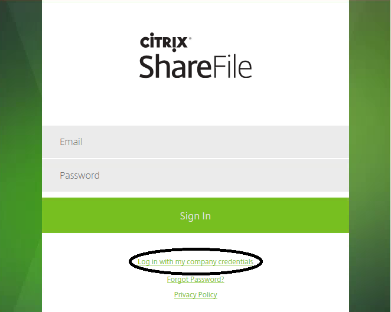

# Single Sign On

## Web Application
Single Sign On (SSO) can be used to make it easier to sign into your FASTDrive account. 

In the past, you would need to remember 2 sets of credentials for both FASTDesk and FASTDrive. With the use of Single Sign On, you can now sign into FASTDrive using your FASTDesk credentials. 

## How to activate Single Sign On

In order to use Single Sign On, you will need to navigate to your ShareFile domain. For example, company.sharefile.eu. This should look something like this on the sign in page: 

As you can see there are 2 options to log into FASTDrive with. The login on the right hand side of the screen will be the regular way to login to FASTDrive with and will use your FASTDrive credentials. The left hand side is to sign in with Single Sign On. Once you click 'Sign In' on the left hand side, you will be re-directed to the following page: 

Here you will need to login with your FASTDesk credentials as opposed to your FASTDrive credentials. 
 
You will then be logged into your FASTDrive account onto the 'Dashboard'.

## In Desktop Applications 
Once you have set-up Single Sign On on the web application, you will then be able to sign into any desktop applications you have. When you load up the desktop application, you will be presented with the login screen. You will need to select 'Log in with my company credentials'. 

You will then be asked to enter the domain for your ShareFile account. This will be the web application URL that you used to initially set up Single Sign On. To save you entering in the full URL, you can also just type in the sub-domain e.g. if the URL is example@sharefile.eu, you can just enter 'example'.

