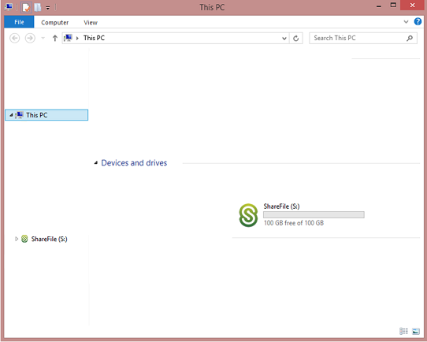
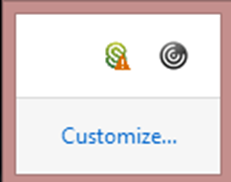
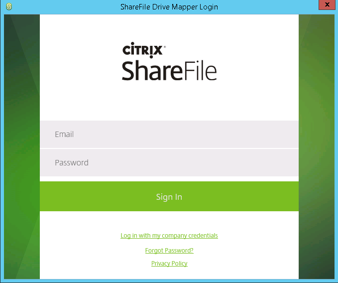

# I can't find Drive Mapper in FASTdesk, what do I do?

FASTdesk desktop users who are also FASTdrive customers will have the Drive Mapper application installed to their desktop by default.

Upon first-time login, Drive Mapper will load by default and you will be prompted to enter your FASTdrive credentials. Once you’ve entered your credentials you will be logged in and will be able to see the mapped drive in File Explorer as shown below.

However, you may come across an issue where you can’t see the mapped drive in File Explorer and can’t see the Drive Mapper icon in the system tray. This occurs if you have right-clicked the Drive Mapper icon and hit ‘Exit’.

After you have clicked ‘Exit’, Drive Mapper will no longer appear in File Explorer and the system tray. However, there’s no need to worry as this can be rectified easily. In order to re-launch Drive Mapper, navigate to your start menu by clicking the Windows icon in the bottom left-hand corner of the screen.

Then locate ShareFile Drive Mapper and left-click this icon.

Drive Mapper will then start up in the background. If you were previously logged in, Drive Mapper should automatically load. If not, navigate to the system tray and double click the Drive Mapper icon. If you aren’t logged in you’ll see an exclamation mark on the Drive Mapper logo like below.

To log in, double left-click this icon and enter your FASTdrive credentials.

