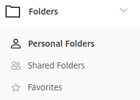
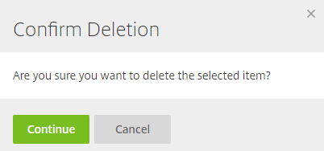
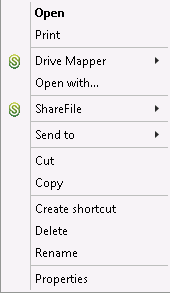
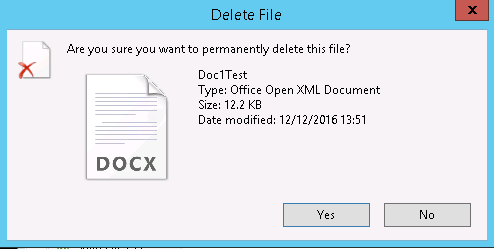
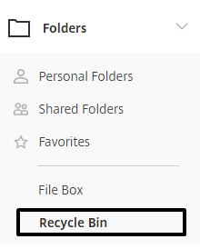

# Deleting Files and Folders

Files and folders can easily be deleted from the Web App or in Drive Mapper.

## Web App:

To delete a folder in the web app, left-click the ‘Folders’ tab which you can see on the left side menu. You’ll see this menu expand into 3 folders; __Personal Folders__, __Shared Folders__, and __Favorites__. Choose the folder where the folder which you would like to delete is stored.

Take into account that you will only be able to delete folders in Shared Folders and Favorites where you have permission to do so. For example, you won’t be able to delete a folder if you only have __View__ and __Download__ permissions.

In order to delete the folder(s), you will need to mark the tick box to the left of the folder name as shown below.

You’ll then see a variety of options at the top of the screen, one of which is __Delete__.

Left click __Delete__ and you’ll be asked if you want to delete this folder.

Once deleted, this folder will be moved to the recycle bin where it will be stored for up to 45 days. However, it may be stored for less time than this depending on factors such as the size of the document, and how much is currently stored in the recycle bin.

## Drive Mapper:

Files and folders can also be deleted easily in Drive Mapper. Firstly, navigate to the Shared Drive in order to find the file or folder that you wish to delete.

To do this, open File Explorer by clicking the yellow folder icon in your task bar.

You then need to navigate to your mapped drive. In the list of drives on the left, you’ll be able to see the following:

If you click the above icon, you’ll be able to see the 3 top level folders; __Personal Folders__, __Shared Folders__, and __Favorites__.

Navigate to the file or folder that you wish to delete. In my example below, I have navigated to a folder called __Test Folder__ which is located under __Personal Folders__.

As you can see above, in this folder is a file called __Doc1Test__. To delete this document, I can left-click the file and press the __Delete__ key on my keyboard.

Alternatively, I can right click the file and press the __delete__ button.

Once you’ve pressed __Delete__, you’ll see the following information pop up on screen. Click __Yes__ to delete the file. Once deleted, this file will be moved to the Recycle Bin.

Unfortunately, the FASTdrive recycle bin can’t be accessed in Drive Mapper. However, this can be accessed on the Web App.

To access the recycle bin, open up the folders tab and click __Recycle Bin__ as shown below.

You’ll then be able to see all of the files which are in the recycle bin. As you can see below, the file that we deleted earlier is now in the recycle bin.

You can delete this file permanently by marking the check box and clicking __Delete Permanently__. Likewise, you can restore the file back to its previous destination by choosing __Restore__.

