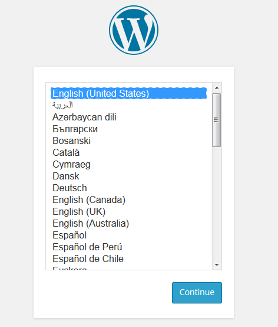
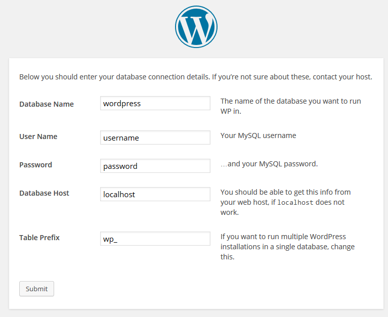
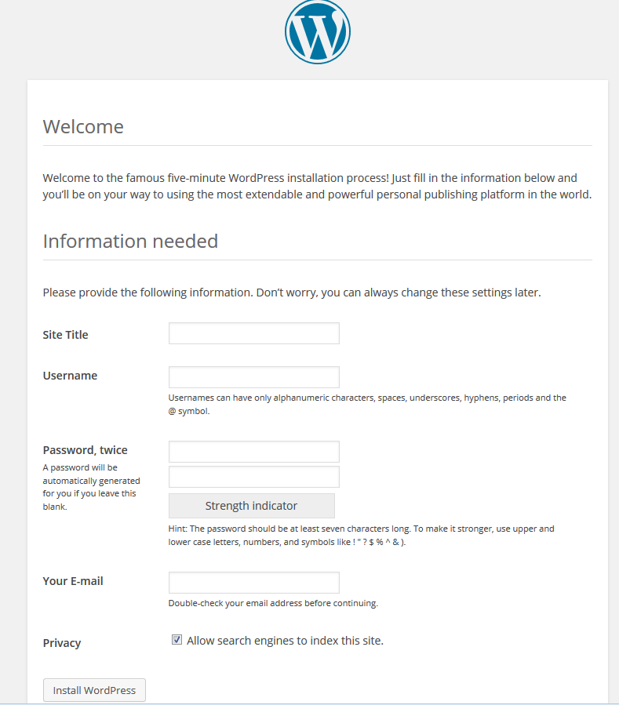

# Wordpress

```eval_rst
.. seealso::
   If you're currently looking at a blank server, you'll first need to follow these guides

   :doc:`/operatingsystems/linux/apache/installation`

   :doc:`/operatingsystems/linux/php/installation`

   :doc:`/operatingsystems/linux/mysql/installation`
```

Wordpress is an incredibly popular blogging platform that's increasingly being used as a CMS.

```eval_rst
.. warning::
    Whilst it's simplicity and wide-use is enticing, it should also be noted that if wordpress isn't kept up to date, along with all it's plugins and themes, it can be a very big security risk.

    As the most used blogging platform, it's also one of the most targeted applications on the internet.

    Care should be taken when installing any third party plugins or themes, as these are often the source of a full server compromise. Only install from very reputable sources and be very wary of any site that claims to have premium themes for cheap or free, these are often backdoored in some way.
```

## Installation

```eval_rst
.. note::
   This guide covers just one method of installing wordpress, via SSH. If you're looking to install it in another way, the installation guide from wordpress is always up to date:

   http://codex.wordpress.org/Installing_WordPress
```

Before we can install wordpress, we first need to download it. Wordpress keeps a handy link to their most recent version, so you should just be able to download it like so:

```console
  wget http://wordpress.org/latest.tar.gz
```

Once you have this archive, uncompress it with this command:

```console
  tar -xzvf latest.tar.gz
```

This will leave you file a directory called `wordpress` in your current directory.

Simply move the files from inside here to inside the location you specified as your DocumentRoot whilst setting up your virtual host:

```console
  mv wordpress/* /var/www/vhosts/somedomain.tld/public_html
```

You'll also probably want to change the ownerships on all those new files so that your webserver can access them. In this example, I'm still using the default apache user:

```console
  chown -R apache: /var/www/vhosts/somedomain.tld/public_html
```

## Database Configuration

Wordpress uses MySQL to store most of its information, so it'll need a database and user setting up.

Enter mysql by typing `mysql` at the command line. This should leave you confronted with a prompt like this:

```console

   [root@asfdasdf ~]# mysql  
   Welcome to the MySQL monitor.  Commands end with ; or \g.
   Your MySQL connection id is 2
   Server version: 5.1.73 Source distribution

   Copyright (c) 2000, 2013, Oracle and/or its affiliates. All rights reserved.

   Oracle is a registered trademark of Oracle Corporation and/or its
   affiliates. Other names may be trademarks of their respective
   owners.

   Type 'help;' or '\h' for help. Type '\c' to clear the current input statement.

   mysql>
```

What you call your database and user is up to you, but in this example I'll be using the rather uninventive `wordpress` and `wordpressuser`.

You'll need to use the `CREATE` syntax to create your new database:

```sql
  CREATE DATABASE wordpress;
```

The user can be created with `GRANT` syntax:

```sql
  GRANT ALL PRIVILEGES ON wordpress.* to 'wordpressuser'@localhost IDENTIFIED BY 'IamANewPasswordMonitorPlectrum';
```

Then we just flush privileges and exit:

```sql
  FLUSH PRIVILEGES;
  exit
```

The above series of commands will have created a databases called `wordpress` a user called `wordpressuser` with a password of `IamANewPasswordMonitorPlectrum`.

The important part to note is `'wordpressuser'@localhost`. This specifies the user `wordpressuser` can only log in from `localhost`, which is pretty good from a security standpoint. If you need access from a remote server, you could run the command again with a different ip or hostname in place of localhost.

```eval_rst
.. warning::
   You could also replace `localhost` with `%`, which would allow connections for that user from any IP address, but unless you have a particular reason for this it should probably be considered quite a security risk.
```

## Wordpress Configuration

Providing your apache configuration is correct, you should now be able to browse to the domain name from your Virtual Host and see the following page:



Select your language and hit continue.

```eval_rst
.. note::
   If you don't see the above step, you're probably missing one of wordpress' dependencies.

   https://wordpress.org/about/requirements/

   If you haven't installed the php-mysql module, this is likely where you'll start to see issues. Check the following page for more information on installing php modules:

   :doc:`/operatingsystems/linux/php/moduleinstallation`
```

The next page should just be letting you know that you're going to need your database credentials, but we've already covered that.

The main page you need to be concerned about is this one:



Enter the database credentials that you set up in the previous step and press 'Submit'.

If you've got your permissions set up correctly, then you shouldn't be asked to manually set up your wp-config.php file, but if you do, just create the file and paste in the content that's provided.

The next screen is much more personal to your blog and is pretty self explanatory:



From here on out, you're good to go. Wordpress is installed on the domain you specified. Enjoy!
