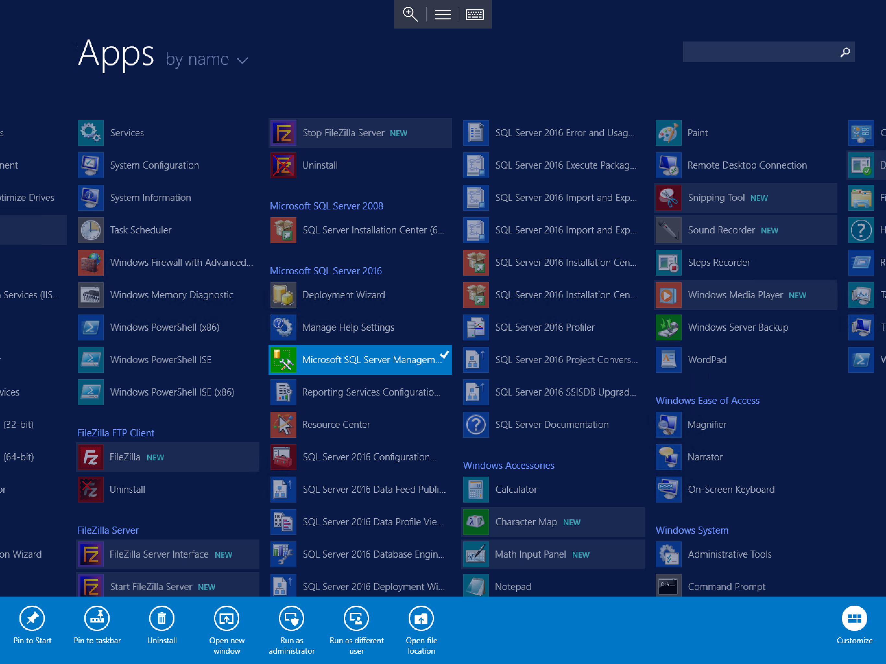
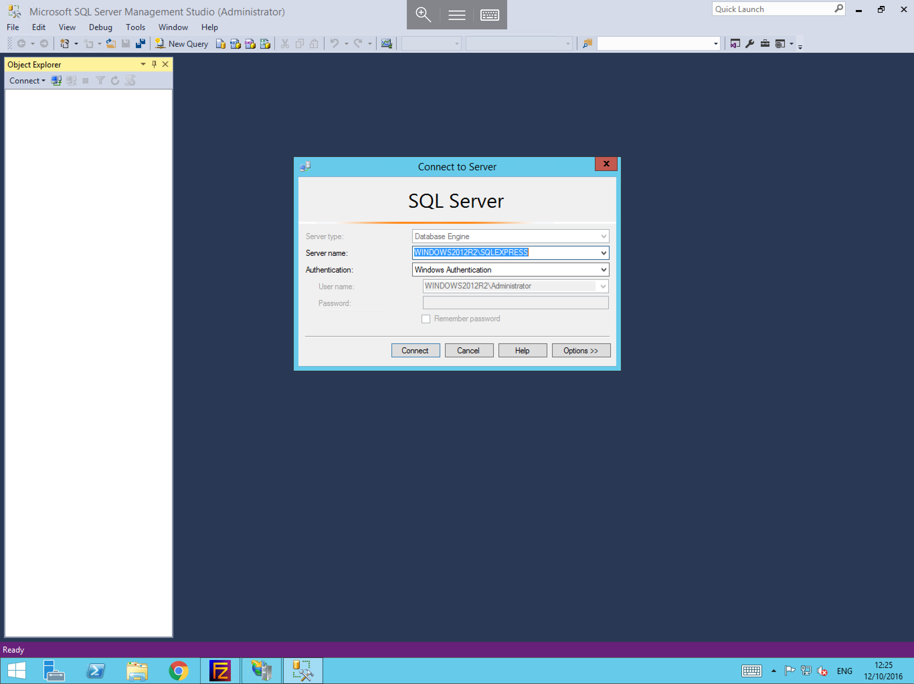

# Connecting to a Microsoft SQL Server Instance

* In order to connect to a Micrsoft SQL Server instance, you will first need to ensure that you have a version of MSSQL Management Studio installed on your workstation, if you do not currently have a version installed, you can obtain one for free from the following link

[Microsoft SQL Server Management Studio](https://msdn.microsoft.com/en-us/library/mt238290.aspx) 

In order to connect to the instance, you will need to select start, then navigate to Microsoft SQL Server management studio as below, and select it from the list of available apps.

You will now be presented with the SQL Server Management Studio, in most instances, a pane called "Connect to Server" should present itself in which you will enter your connection details, if however this does not present itself, please select "Connect" from the object explorer on the left hand side of the window, this will launch the "Connect to server" pane as below.

In order to connect to the Instance, you will need to enter the correct connection details in to the "Connect to Server" pane as has been demonstrated above. 
* please note that Windows Authentication may not be enabled on your Instance, if this is the case, you will need to use the "SA" Credentials to authenticate instead.
  in order to do this, you simply need to select the arrow next to the "Authentication" field, and select "SQL Server Authentication" then enter your SA credentials in the user name and password fields below.

Once you have entered the required details, please select "Connect"

SQL Server Management Studio will now log you in, and you will be able to see your SQL instance within the Object Explorer as below

* You should now be connected to your database, and you now have the ability to administer the Instance in the same way that you would be able to if you were logged directly in to the Database Server.
