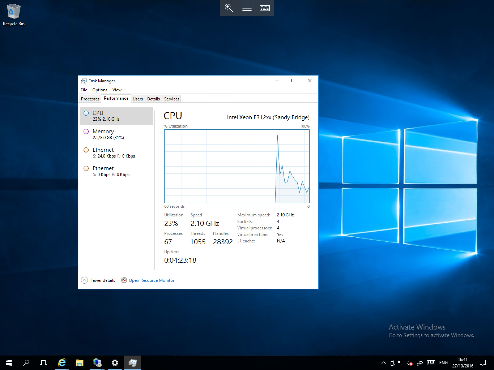
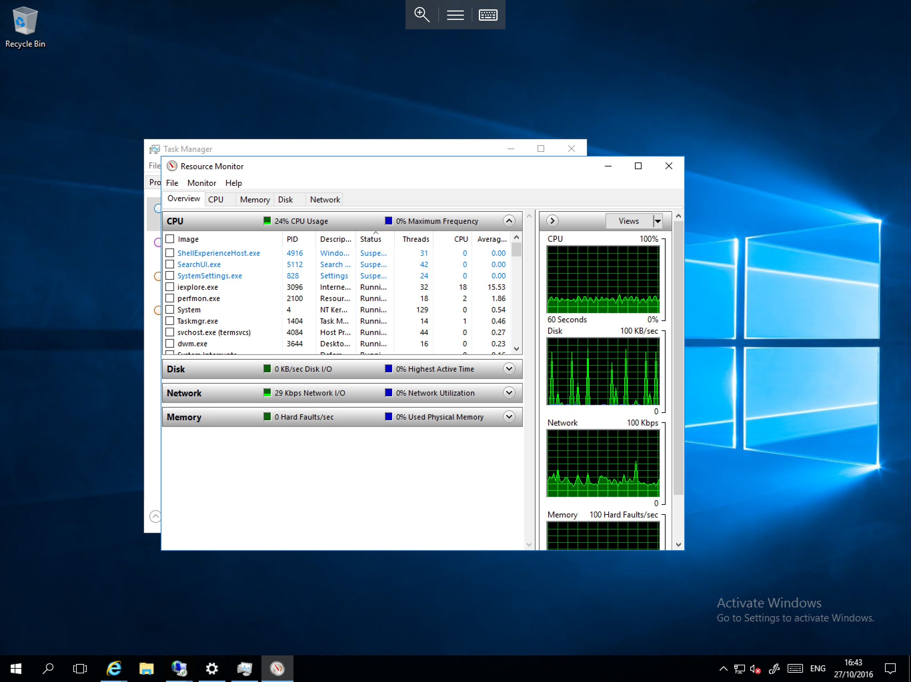
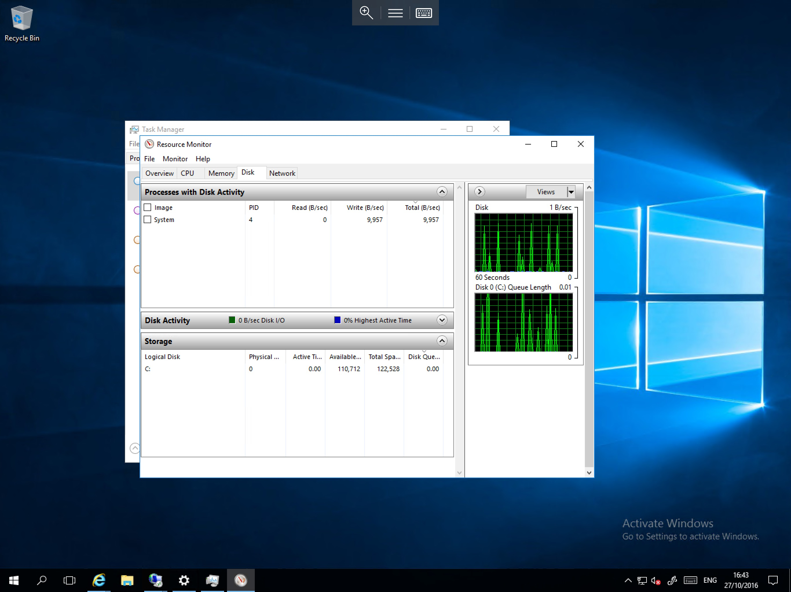
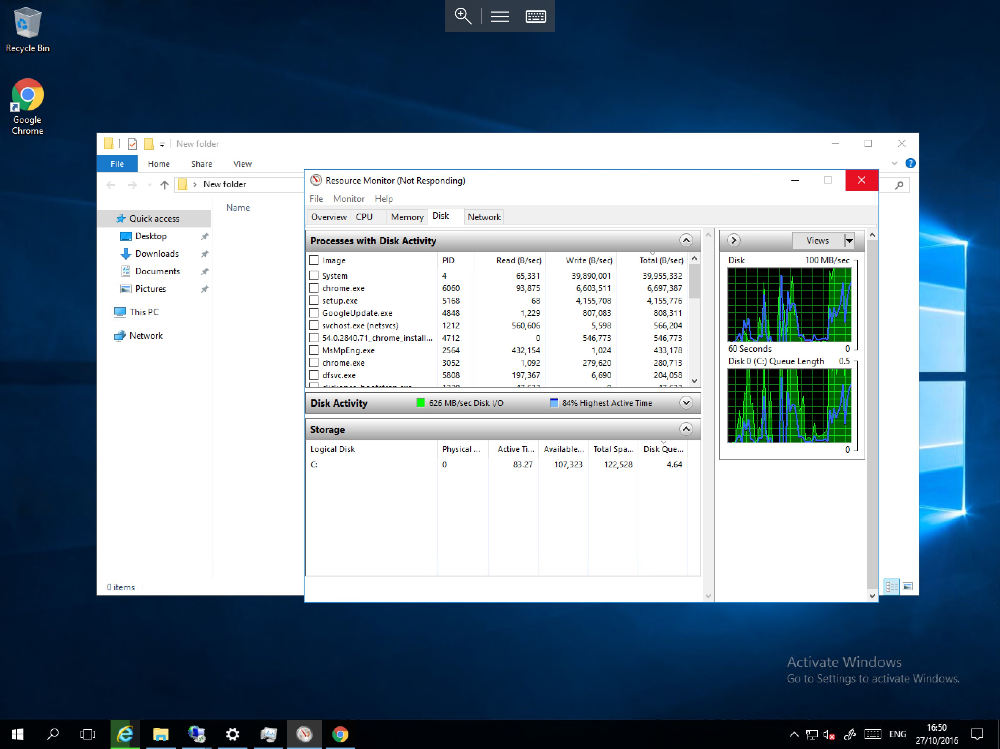

# Using Resource Monitor to inspect current working processes.

* The Windows Resource Monitor can be useful when experiencing and attempting to diagnose performance issues on your server, please follow the below guide to make use of the Resource Monitor

In order to launch the Resource Monitor, you will first need to open the task manager, to do so, right click on the taskbar and select "Task Manager" from the resulting context menu, you will then be presented with the task manager as below

select the Performance Tab and then select " Open Resource Monitor " from the bottom of the window. You will now be presented with the Resource Monitor Overview which can be used to view current overall resource consumption as below

* In the Overview tab, you can view information relating to current usage of CPU, RAM, Disk, and the network, if you wish to view more specific information on any one of the aforementioned resources, 
  you can select the appropriate tab along the top line of the window, for this example, we will demonstrate an inspection of disk resource usage.

Select the Disk tab within Resource monitor, and you will be presented with more information on disk usage, including "processes with disk activity", "Disk Activity" and "Storage" as below

The above image shows that only the system process is currently using disk resources, in the storage section of the view, you can see that the Disk Queue for drive C: is 0.00, this means that the disk is under next to no load at present, however, if you are experiencing slow performance/response on the server, it could be due to a high Disk Queue as depicted below

In the Above image, you can see that the Disk Queue for drive C: is 4.64, this means that the drive has 4.6 times the volume of read/write requests than what it can efficiently handle per second, If this figure stays above 2 for a prolonged period of time, it is indicative of an IO bottleneck and will likely be causing performance issue.

In our example, you can see that the System process, setup.exe and Chrome.exe are causing the largest volume of disk IO activity, by identifying the responsible processes, you can analyse those processes to ascertain the root cause of the high disk queue. For example the issue in our demonstration is that Windows Updates are being installed, files are being downloaded via chrome.exe and Windows is indexing the new files
