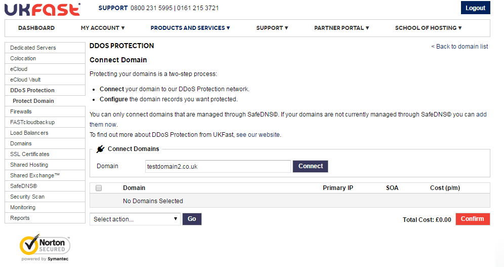

# Getting started

Protecting your domains using DDoSX<sup>TM</sup> is a two-step process:

- **connect** your domain(s) to our DDoSX<sup>TM</sup> network
- **configure** which domain records you'd like to protect

```eval_rst
.. seealso::
   To use DDoSX\  :sup:`TM` from UKFast, you also need to manage your DNS records using SafeDNS.  If you're not already doing so, please see the section on :doc:`/Domains/safedns/index` to set this up first.

   Use SafeDNS to point your domains to the UKFast nameservers, which are:

   - ns0.ukfast.co.uk
   - ns1.ukfast.co.uk
```

To enable DDoSX<sup>TM</sup> for your domain(s), follow these steps:

- Login to [MyUKFast](https://my.ukfast.co.uk) and head to `DDoS Protection` in the `Products and Services` menu.
- Click `Protect Domain`
- On this page you can search for the domains you're managing through SafeDNS.  Choose the domain you wish to protect and click `Connect`.  Repeat for each domain you wish to protect.



- If appropriate, go through the payment process. (You won't have to complete this step if you've already ordered DDoSX<sup>TM</sup> via your UKFast account manager).
- Next click `Configure` and then choose which A Records and AAAA Records you specifically want to protect for each domain.  You can also assign any existing SSL certificates at this point.


- Click `Activate` and your domain is now connected to the UKFast DDoSX<sup>TM</sup> network, and configured appropriately.  

Note that it may take up to 24 hours for DNS changes to propogate across the internet (as with any such changes), and before your domain is fully protected.
