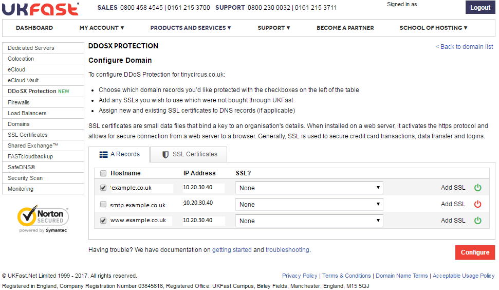

# Getting started

Protecting your domains using DDoSX<sup>TM</sup> is a two-step process:

**1. connect** your domain(s) to our DDoSX<sup>TM</sup> network

**2. configure** which domain records you'd like to protect

```eval_rst
.. seealso::
   To use DDoSX\ :sup:`TM` from UKFast, you need to have your domains' nameservers pointing to the UKFast nameservers, and you also need to manage your DNS records using SafeDNS.  

   Make sure to set up your DNS records correctly in SafeDNS first - see the :doc:`/Domains/safedns/index` guide for assistance.  You must move all records associated with the domains (including sub-domains) you wish to protect, including SMTP, MX, mail etc. to SafeDNS.

   Once you have done this, point your domains to the UKFast nameservers, which are:

   - ns0.ukfast.net
   - ns1.ukfast.net

   You'll need to do this through whichever domain registrar you use to manage your domains (which may not be UKFast).  If you don't know who your domain registrar is you can do a 'WHOIS' lookup on websites such as https://www.nominet.uk/whois/

```

To enable DDoSX<sup>TM</sup> for your domain(s), follow these steps:

## Connect domain

- Login to [MyUKFast](https://my.ukfast.co.uk) and head to `DDoS Protection` in the `Products and Services` menu.
- Click `Protect Domain`
- On this page you can search for the domains you're managing through SafeDNS.  Choose the domain you wish to protect and click `Connect`.  Repeat for each domain you wish to protect.


- If appropriate, go through the payment process. (You won't have to complete this step if you've already ordered DDoSX<sup>TM</sup> via your UKFast account manager).

## Configure domain

- Next click `Configure` and then choose which A Records and AAAA Records you specifically want to protect for each domain.  You can also assign any existing SSL certificates at this point.  SSL certificates purchased from MyUKFast will appear in the dropdown menu, or click `Add SSL` to add details of other SSL certificates manually.



- Click `Activate` and your domain is now connected to the UKFast DDoSX<sup>TM</sup> network, and configured appropriately.  

Note that it may take up to 24 hours for DNS changes to propogate across the internet (as with any such changes), and before your domain is fully protected.
