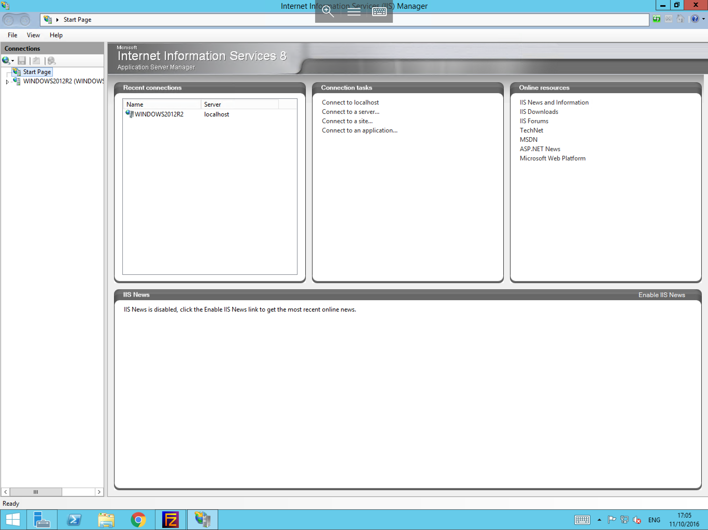
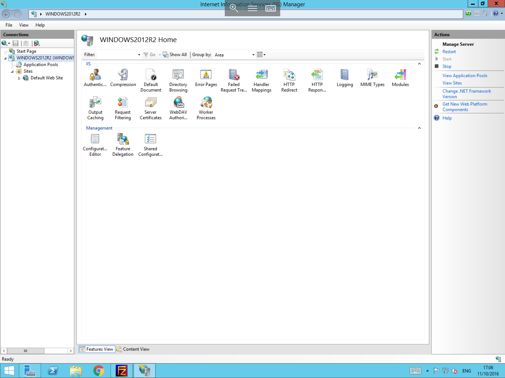
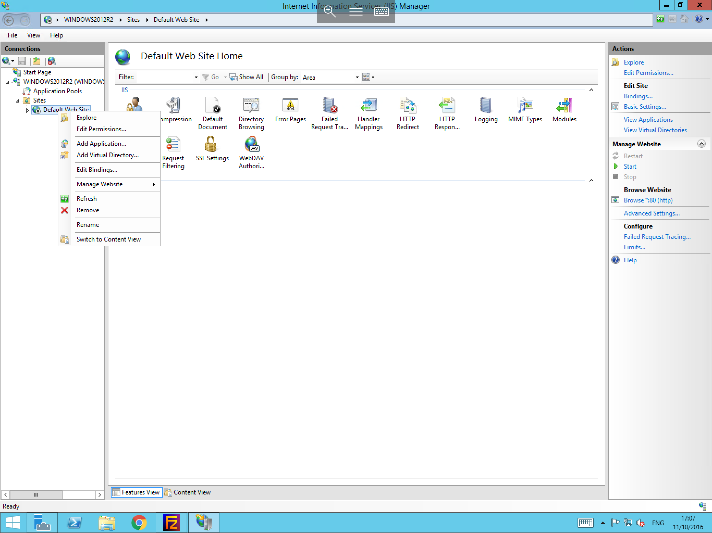
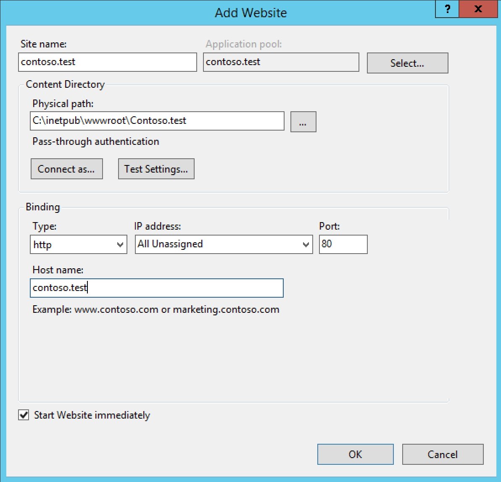
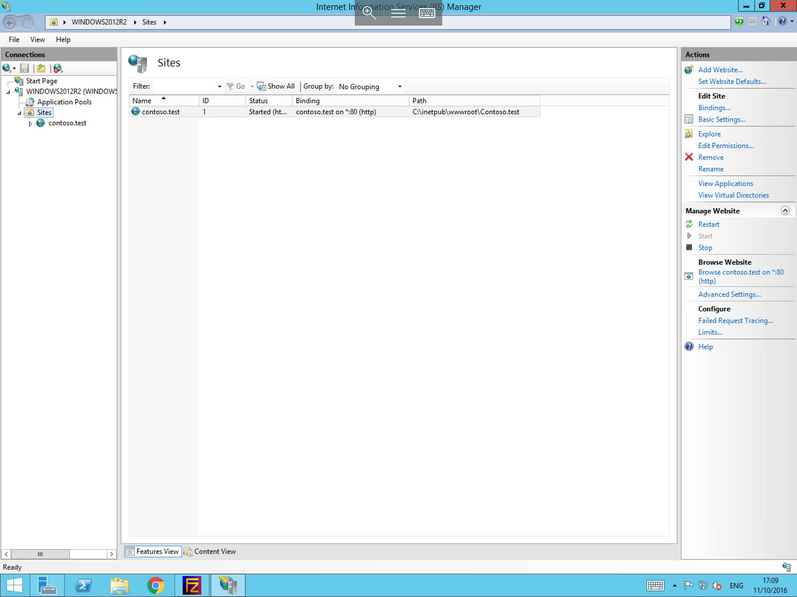

# Setting up your first site in IIS

In order to begin the process of setting up your first site in IIS, you will first need to open the IIS Manager, you can do this 2 ways
* By selecting Start > Administrative Tools > Internet Information Services (IIS) 
* By selecting server manager, then selecting the tools button, and selecting inernet Information Services (IIS)

Once IIS has been launched, you will be presented with a landing page similar to the one below

   

   
From this page, please pop out the server instance (in this case named "Windows2012R2"), and pop out the sites tab to reveal "Default Web Site" as below

Select the Default Web Site and right click to bring up the context menu, select "Remove" from the list of options as below. this will delete the Default Web Site from your IIS instance.

Now right click on the Sites tab, and select "Add Website", you will now be presented with the "Add Website" pane, within this pane, you will need to add several details about the site which you wish to create.

* Within the site name box, please enter a display name for the website, this will define the name listed in IIS for this site, 
* The next data field is the "Content Directory" Physical path. This can be any location on the server which you choose, to select the location, select the ... button and navigate to your chosen location
* For the Binding section, select the type of traffic that you wish to create a binding for, i.e http or https, then select the ip and port which you would like the site to listen on, and finally, add the hostname of your site, in this example contoso.test

The "Add Website" pane should now look very similar to the example below

Once you are happy that the details are correct, please select "Ok". You will now be returned to the IIS Manager, where you should be able to see your new site listed within the connections pane on the left hand side of the window.

* Your new site is now added to IIS and is ready to accept connections once the required content has been added, and the appropriate changes have been made in DNS.

