# How to configure X-Forwarded-For (XFF) in IIS

* If your solution makes use of a layer 7 load balancer with multiple web backends, from the webservers all traffic will be logged as being from the load balancer, this can be a problem in several scenarios where you need to identify the source of traffic.
  The X-forwarded-for Header can be used to keep the source ip of inbound traffic, and log the original ip in your logs.

Different Versions of IIS have different proceedures which need to be followed to enable X-forwarded-for, please follow the appropriate section below.

## X-Forwarded-For in IIS 7 & 7.5

* In order to utilise X-Forwarded-For in IIS 7 or 7.5, the Advanced Logging module will need to be installed, this can be downloaded from the link below

[IIS Advanced logging](https://www.microsoft.com/en-gb/download/details.aspx?id=7211)

Once you have installed the module, please install it by following the simple Wizard.

With the module installed, select IIS and select the your site from the menu, now in the features view, you will see Advanced logging as below, please select this module

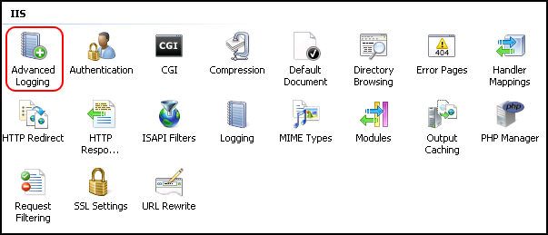

Once selected, select "Enable Advanced Logging" from the Actions pane to the right hand side of the window, as below

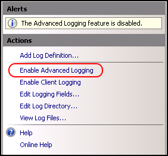

Then select "Edit Logging Fields" again from the actions pane as below

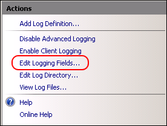

You will now be presented with the Edit Logging Field pane, select "Add Field", and then add the following information

* Field ID = ClientSourceIP
* Category = Default
* Source type = Request Header
* Source name = X-Forwarded-For

Once you have entered the above details, please select OK and you should be Returned to the Edit Logging Field pane which should now look like below, please select ok.

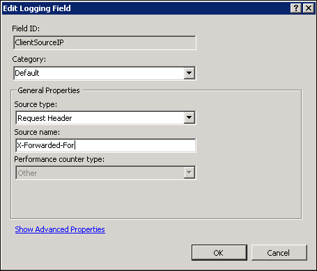

You will now be returned to the IIS window, from the actions pane, select "Add Log Definition" as below

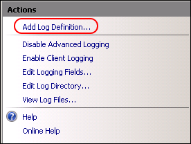

You will be presented with the log definition window, please enter Client Source IP in the "Base file name:" field as below and then select the "Select Fields" button at the bottom of the window

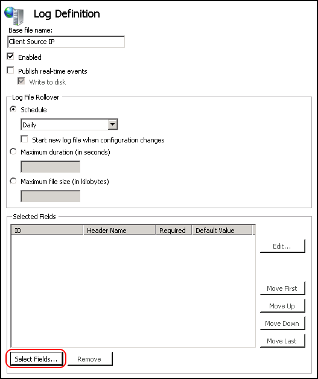

From the resulting "Select Logging Fields" window, please tick the ClientSourceIP ID from the list as below, and then select OK and select Apply from the Actions pane.

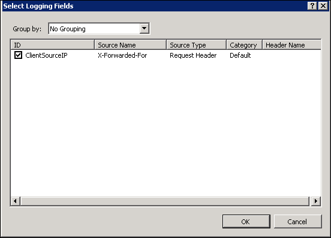
 
Select "Return To Advanced Logging" from the actions pane.

* To fully apply the advanced logging rules, you will need to carryout an IIS Reset from an administrative command prompt, if you are unsure how to do this, please follow our guide in the IIS section.

With an IIS restart having been completed, your advanced logging function should now be operational, to view the advanced logs, you can do so 2 ways

1. Navigate to C:\inetpub\logs\AdvancedLogs
2. Select the Advanced logging module in IIS, right click on the "Client Source IP" rule, and select "View Log Files" as below

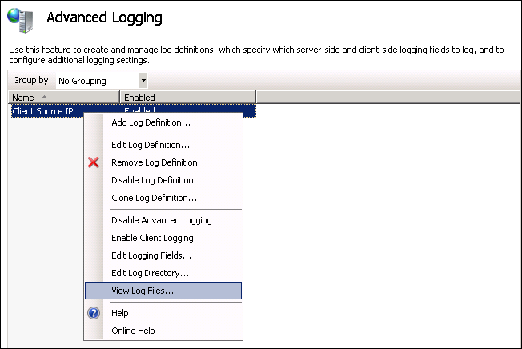

## X-Forwarded-For in IIS 8.5 and Above

* In Older Versions of IIS, the Advanced logging had to be installed to support X-Forwarded-For, in IIS 8.5 this is not the case.
  To configure X-forwarded-for in IIS 8.5 or above, please follow the steps below.

Launch server manager by selecting start, and selecting server manager from the list of available application, alternatively, select the server manager icon from the taskbar.

Within Server manager, select "Tools" from the top section, and select Internet Information Services (IIS) from the resulting list as below

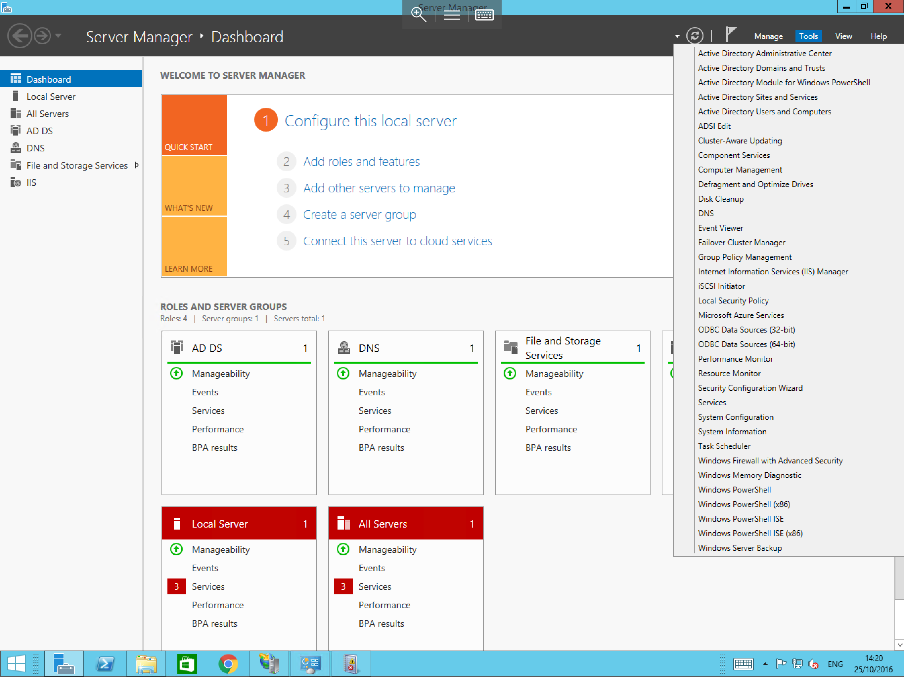

you will now be presented with the IIS manager, from the connection pane on the left hand side of the window, select your site (if you wish to have logging for specific sites) or select the server instance (if you wish to enable logging for all sites)
Once you have made your selection, select "Logging" from the Feature view in the centre of the window as below

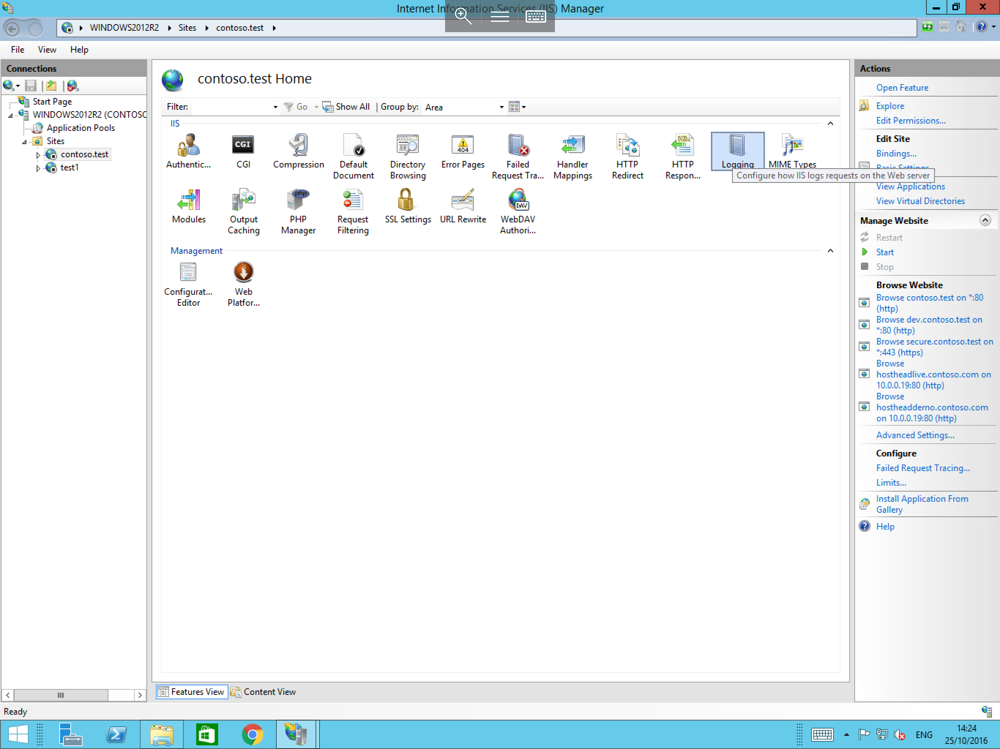

You will now be presented with the logging options, under the "log file" section, please select format "W3C" and select the "Select Field" button next to it as below

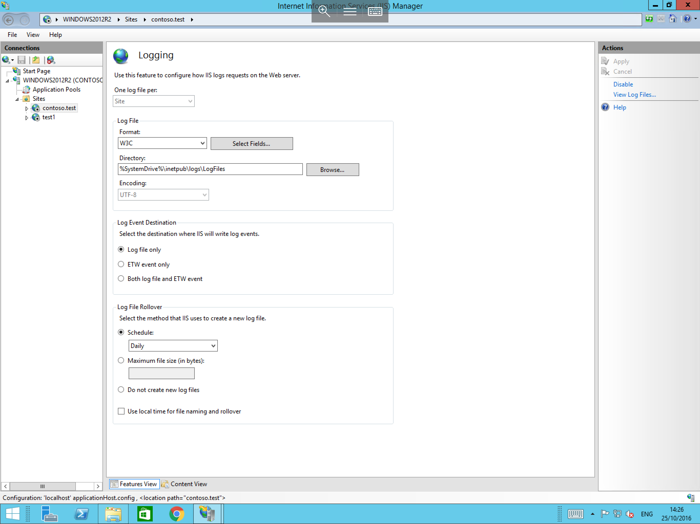

The "W3C Logging Fields" pane will now presented, in this pane, please select "Add Field" from the bottom of the pane as below

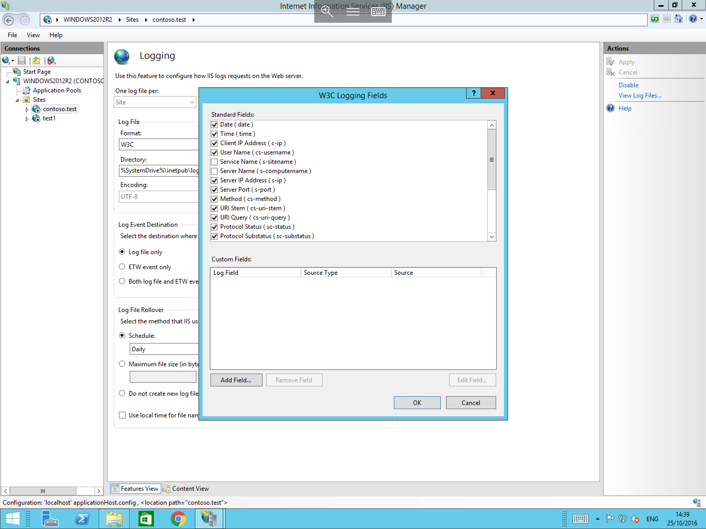

In the resulting "Add Custom Field" pane, please enter the following

* In the Field Name, please enter a name which can be used to identify the field in the log files for example `SourceIP`
* In the "Source Type" field, Please select "Request Header"
* In the "Source" field, please select the box and type X-FORWARDED-FOR

The Add Custom Field pane should now look as follows

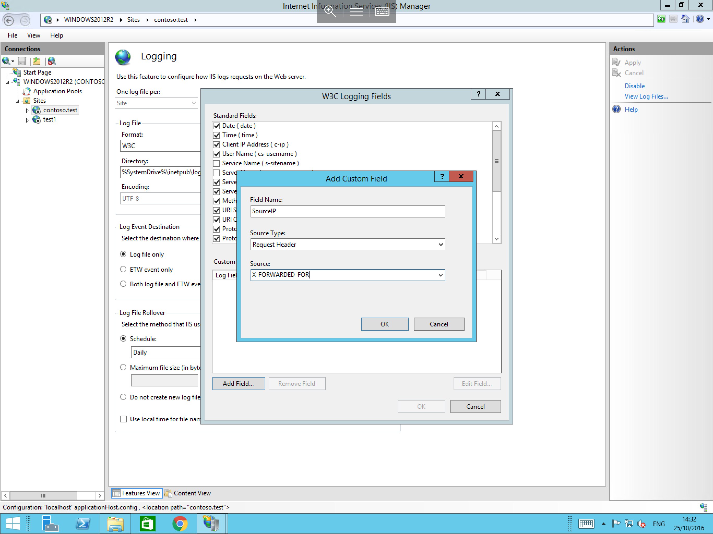

Now select "OK" and you will be returned to the "W3C Logging Fields" pane, where your new field should be visible as below, select "OK" to complete the process.

* Further information and different functions of the IIS 8.5 Enhanced logging module can be found at the link below

[IIS 8.5 Enhanced Logging](https://www.iis.net/learn/get-started/whats-new-in-iis-85/enhanced-logging-for-iis85)

