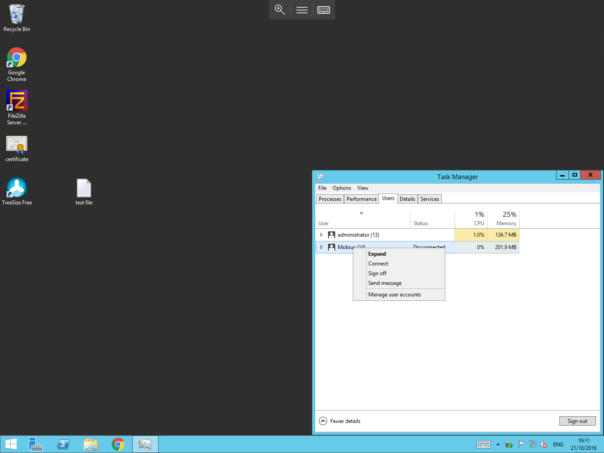

# Managaing Remote Desktop Sessions

* If ever you need to know which users are logged into your server(s) you can view this information using Windows Task Manager. 

To View Currently logged in users, please follow the below steps

Right click the taskbar and select task manager, you will now be presented with the task manager pane, within the pane, please select "Users from the available tabs.
You will now be able to view a list of currently connected users as below, right clicking on any particular user, reveals a a number of options which are explained below, you can also pop out the arrow next to each user to view which processes they are currently using.
(Please note, that the available options, will depend on the current status of each user, i.e Active, Disconnected etc.

* Send Message - Allows you to type a message to this user which will display on their desktop once sent.
* Connect - Take over this users session. If the user is a different account to the one you're logged in with you will be prompted for the new users credentials
* Disconnect - Disconnect the users session. This will leave all of their applications/documents open but will force the users remote desktop session to close on their screen.
* Sign Off - Disconnects the clients session and closes all open applications/documents.
* Remote Control - Allows you to share a remote desktop session with this user. The user will be prompted to accept your request before sharing begins.