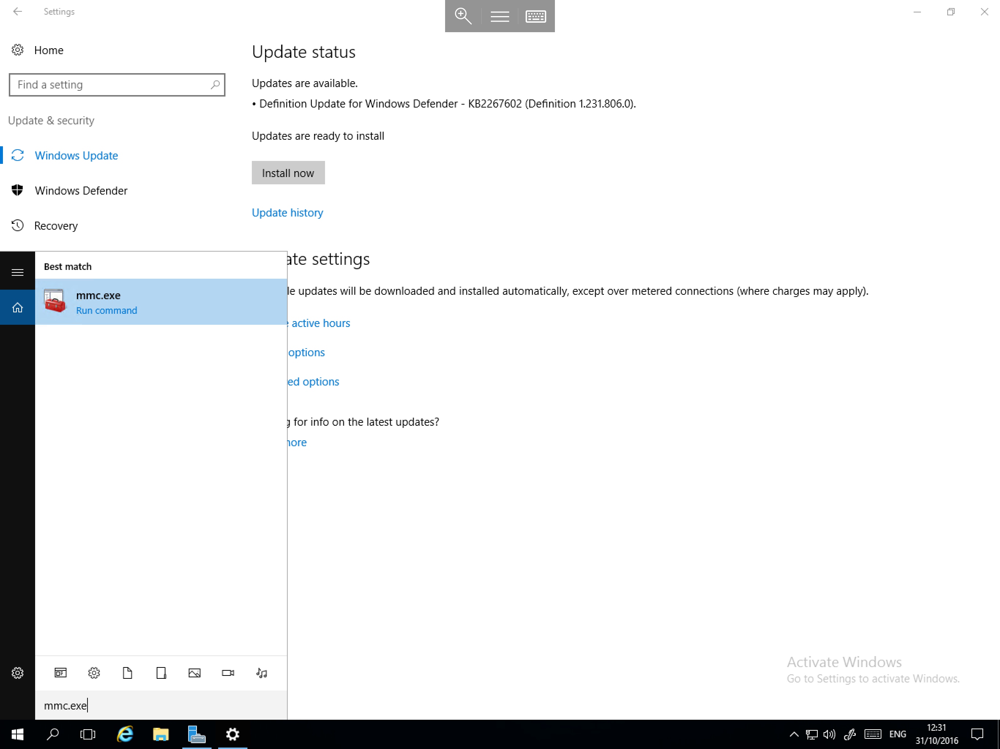
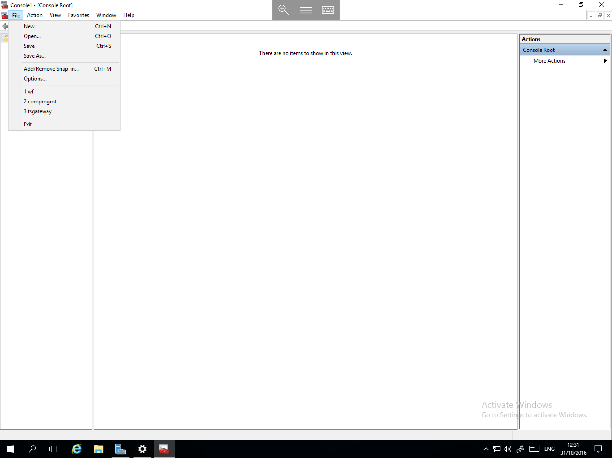
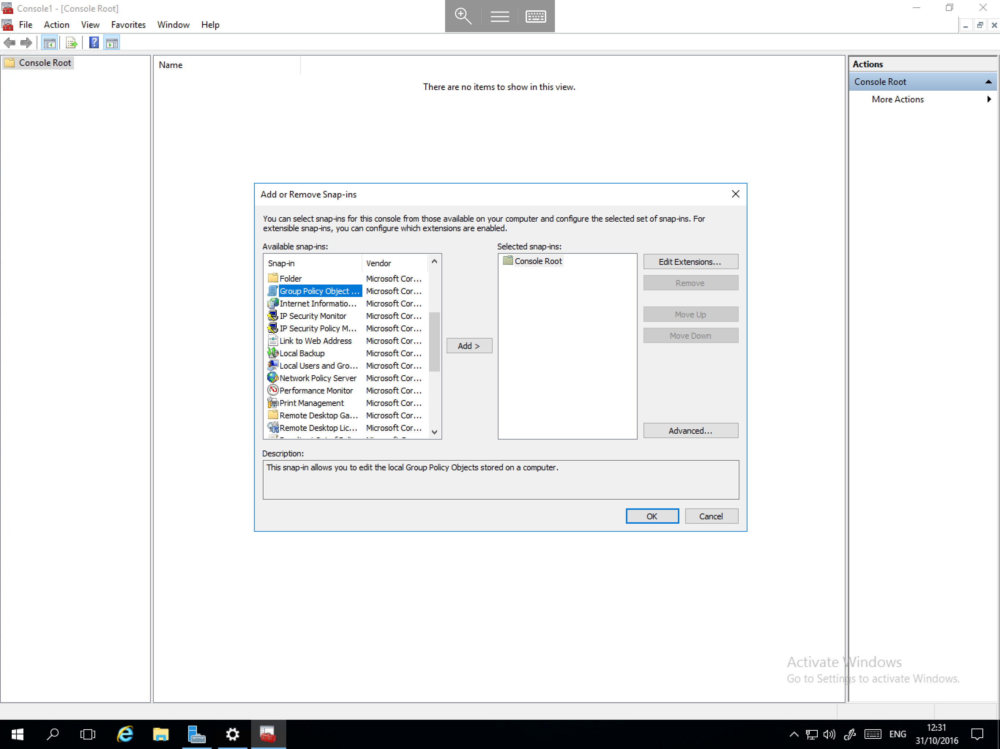
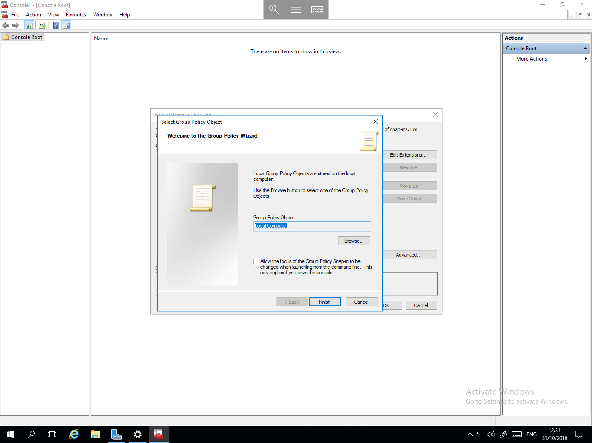
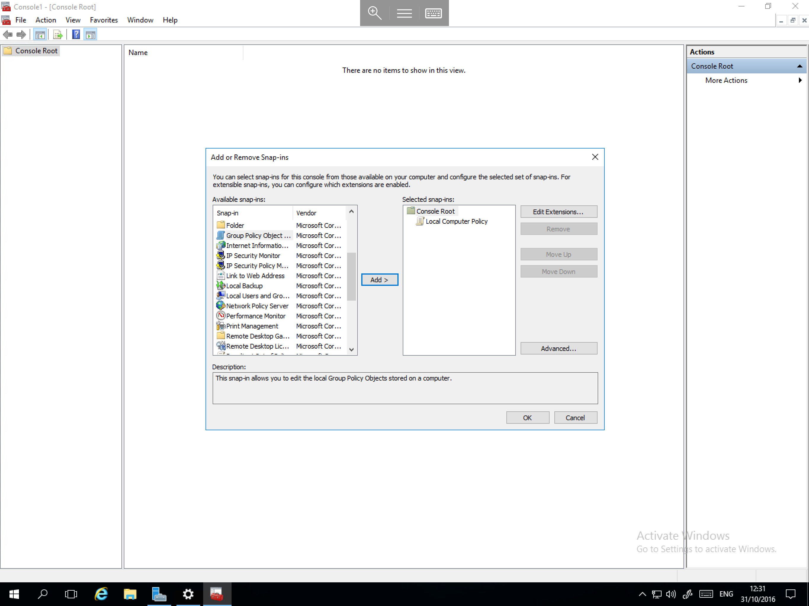
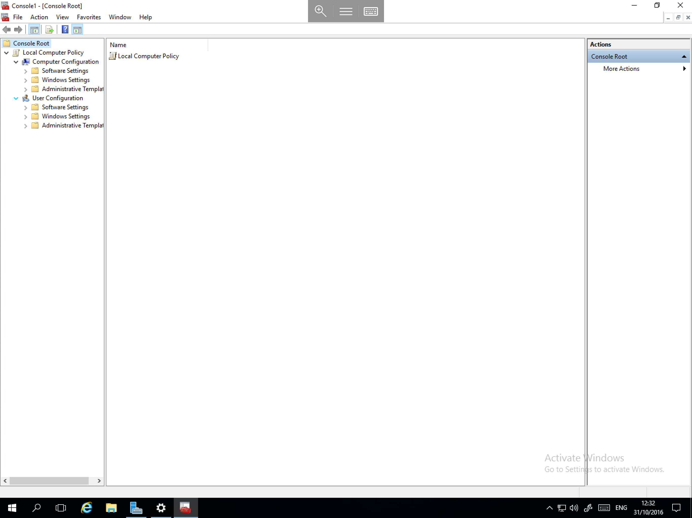
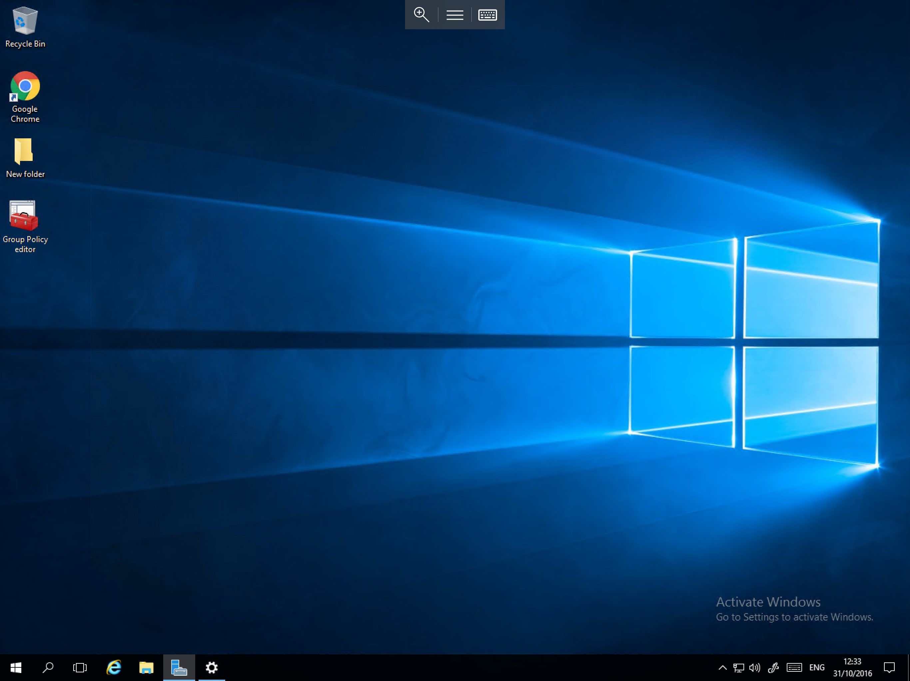
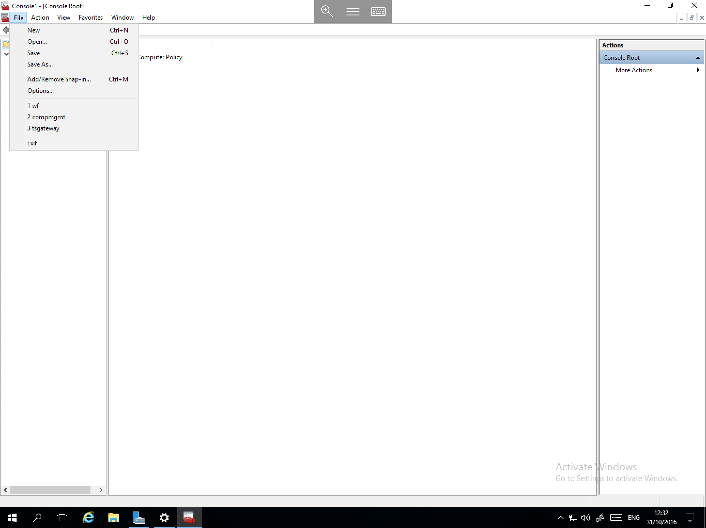

# Accessing Local Group Policy

* Accessing Local Group Policy in Window Server 2016 requires a slightly different method to be used as compared to in previous versions of Windows Server
  To Access Local Group Policy, please follow the below guide

Select the start menu, and type `MMC`, now select the resultant MMC.EXE as below

You will now be presented with a blank Management Console window, select file and `Add/Remove Snap in...` as below

The "Add Or remove Snap-ins" window will now be presented, in the left hand side of the window, you will see "Available snap-ins", scroll down the list and select "Group Policy Object Editor" as below, then select the "Add >" button in the centre of the window

You will now be presented with the "Select Group Policy Object" Window, by default this should be prepopulated with "Local Computer", please leave this as it is and select "Finish" as below

The Add or Remove Snap-ins window will now be returned to view, and you should be able to see the Local Computer policy listed in the "Selected snap-ins" section on the right hand side as below, now select "OK"

You will now be returned to the Management Console, in the left hand field, you will be able to see "Local Computer policy", select the arrow to pop the menu out, and you will now be able to see the Group policy as below

To Ensure easy access to the Group policy editor in future, we recommend saving the console view, this allows you to access the policy editor by simply opening a shortcut, as below

To save a copy of the console, from the console menu, please select File, and select Save as, as below

Choose a location for the Console to be saved to, and give it a name which will allow it to be identified in future such as "Group Policy Editor" and select the save button.