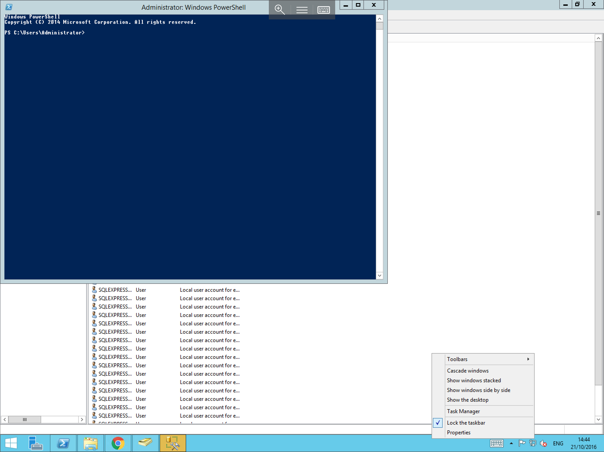
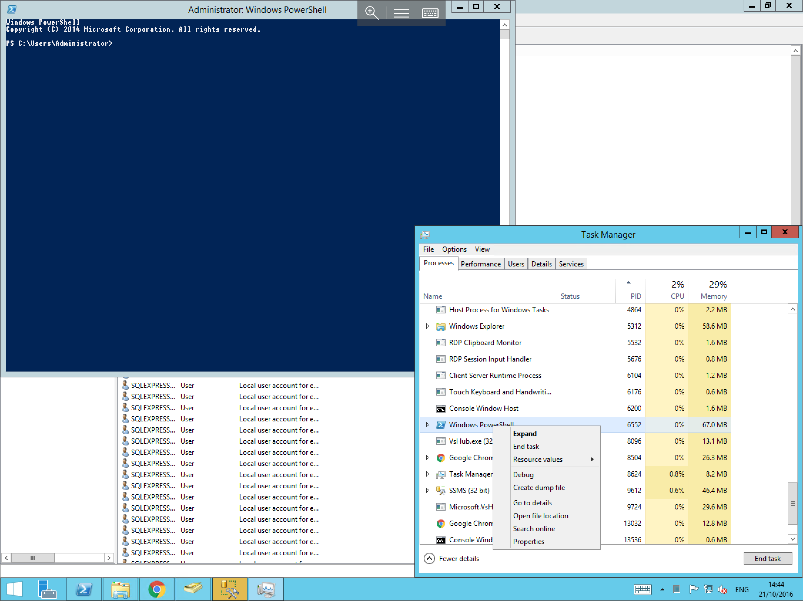
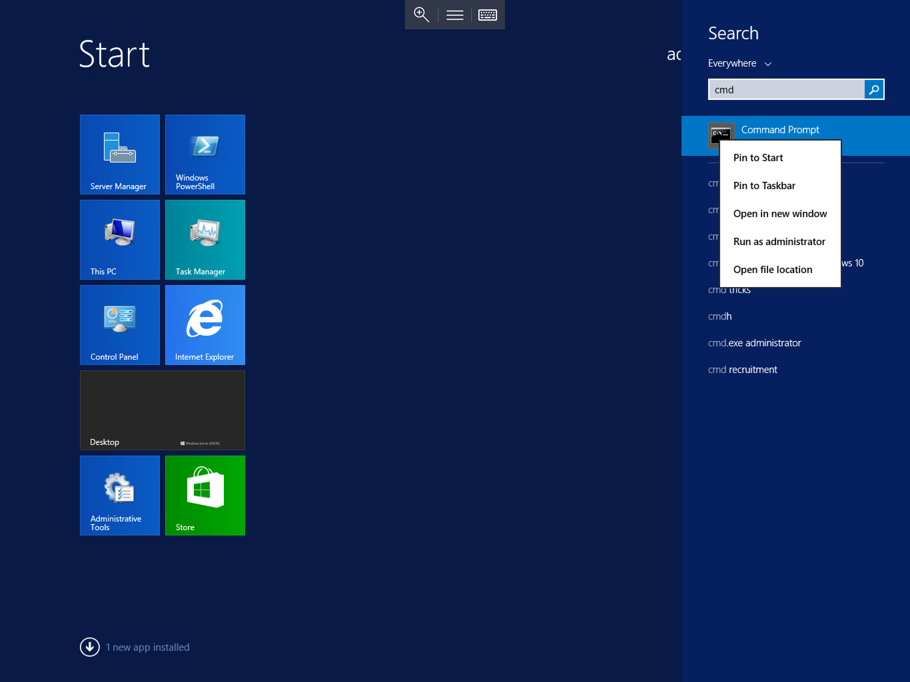
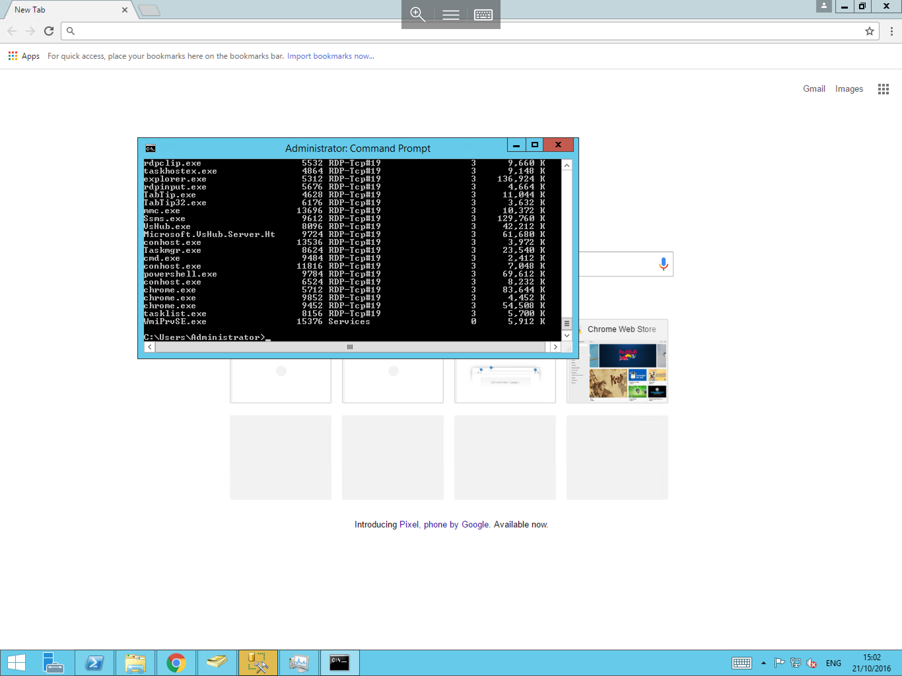
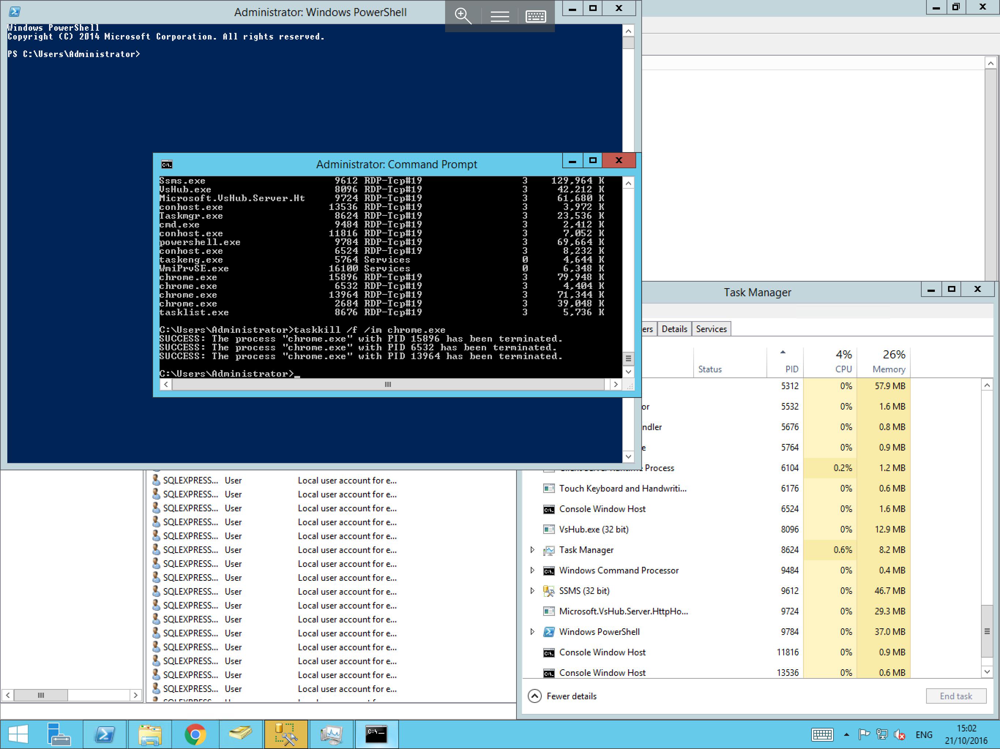

# How to Forcibly end a process in Windows

* In some instances applications and processes can become unresponsive and require manual intervention to forcibly end the process. 

In order to forcibly end a process, you have two methods available to you

## End a process using Task Manager

To forcibly end a process using task manager, right click on the start menu, and select task manager as below

You will now be presented with the Task Manager, Select the "Processes" tab from the top line as below

Scroll down the list until you find the process which you wish to end, right click the process, and select "End task" as below

## End a process using the Tasklist and TaskKill commands

To Forcibly end a process using the command line, select the start menu, and type "cmd", right click the resultant cmd.exe and select run as administrator as below

In the command prompt, type `tasklist` and press enter, this will display a list of running processes as below, locate the process which you wish to end in the list, and make a note of the name or the PID

Now in the command line, type either taskkill /f /im "process name" and press enter to end a process by its name or taskkill /f /PID "number of pid" and press enter to end a process by its PID | 
For example (By Name) `taskkill /f /im chrome.exe` as below or (By PID) `taskkill /f /PID 15896` 

* For the full command line syntax of Tasklist and Taskkill, please visit the respective link below

[Tasklist](https://technet.microsoft.com/en-us/library/bb491010.aspx)

[Taskkill](https://technet.microsoft.com/en-us/library/bb491009.aspx)

